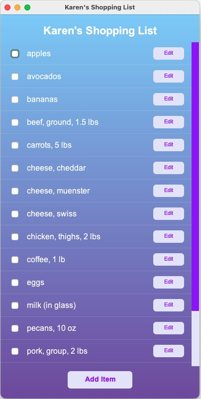
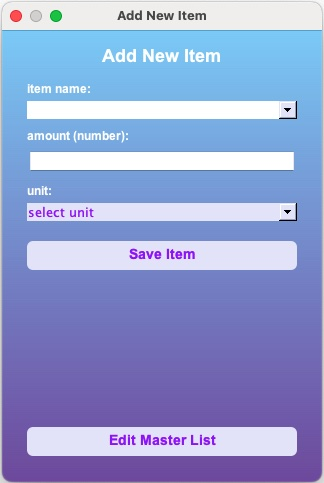
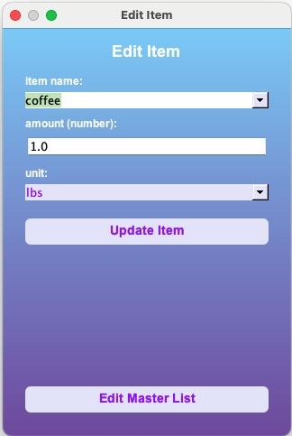
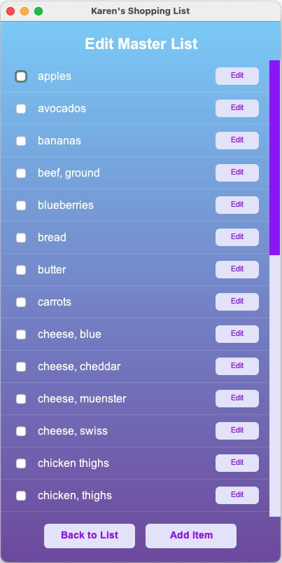
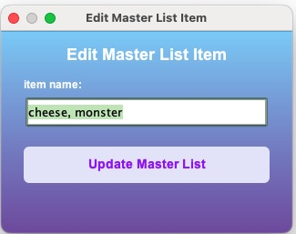
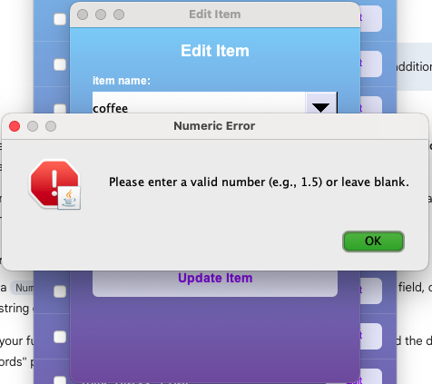

# Karen's Shopping List Manager
**Author:** [Your Name]

## Description
Karen's Shopping List Manager is a Java Swing application designed for grocery planning. The application features persistent CSV storage, a custom graphical interface, and data management for both an active shopping list and a historical master list of items.

### Key Features:
* **Persistent Storage:** Automatically saves and loads state using two files: `shopping_list.csv` for the active list and `master_list.csv` for the historical item database.
* **Seed Data:** On the first run, if no master list exists, the application populates the database with a default set of 25 common grocery items.
* **Autocomplete Suggestions:** Utilizes a `TreeSet` to store and alphabetically sort unique items added over time, providing filtered autocomplete suggestions for new entries while preventing duplicates of items already on the active list.
* **Dual Views:** Allows users to toggle between managing their active shopping list and editing the global master list.
* **Custom UI:** Features a custom "Electric Purple" and "Lavender" theme with gradient backgrounds and anti-aliased rounded buttons.
* **Input Validation:** Includes exception handling for numeric inputs and empty fields to prevent application crashes during data entry.

---

## Project Structure
The project follows a modular **Model-View-Controller (MVC)** architecture:

| File | Role |
| :--- | :--- |
| **`ShoppingListApp.java`** | The entry point (Driver). Initializes the data manager, seeds the initial master list, and launches the GUI on the Event Dispatch Thread. |
| **`ListManager.java`** | The Controller. Manages the datasets for the active shopping list and the master item history, including CSV file I/O and filtering logic. |
| **`ShoppingItem.java`** | The Model. Encapsulates grocery item fields (Name, Amount, Unit) and handles name normalization and unit formatting. |
| **`ShoppingListGUI.java`** | The View. Contains all Swing components, custom paint logic, dialog generation, and event listeners for toggling between list views. |

---

## How to Use It

### Prerequisites
* Java Development Kit (JDK) 11 or higher.
* A terminal or IDE.

### Installation & Running
1.  **Navigate to the source folder:**
    ```bash
    cd src
    ```
2.  **Compile the source code:**
    ```bash
    javac *.java
    ```
3.  **Run the application:**
    ```bash
    java ShoppingListApp
    ```

### Using the App
1.  **Add Items:** Click the "Add Item" button. Start typing in the dropdown; the app will suggest items from your master history.
2.  **Edit Items:** Click the "Edit" button next to any item on the active list to modify its name, quantity, or unit.
3.  **Check off Items:** Click the checkbox next to an item to remove it from your active list (it remains in the master history).
4.  **Manage Master List:** Click the "Edit Master List" button inside the Add/Edit dialog to switch views. Here, you can add, edit, or remove items from the global reference list.
5.  **Persistence:** Changes are saved automatically after every modification. The active list and master list will reload upon the next application launch.

---

## Screenshots

### Main Interface
The primary application window showing custom Swing components, gradient background, and the persistent shopping list.


---

### Smart Item Entry & Updates
The "Add" and "Edit" interfaces. The name field provides autocomplete suggestions powered by a `TreeSet` of historical items.




---

### Ability to Edit Master List
The Master List can be modified via "Add" and "Edit" interfaces that focus exclusively on editing the item name for the global database.




---

### Exception Handling & Validation
The application validates user inputs before processing:

**1. Logical Validation:** Prevents the creation of items with empty names.


**2. Data Type Validation:** Uses `try-catch` blocks to handle `NumberFormatException` when non-numeric data is entered into the amount field.
