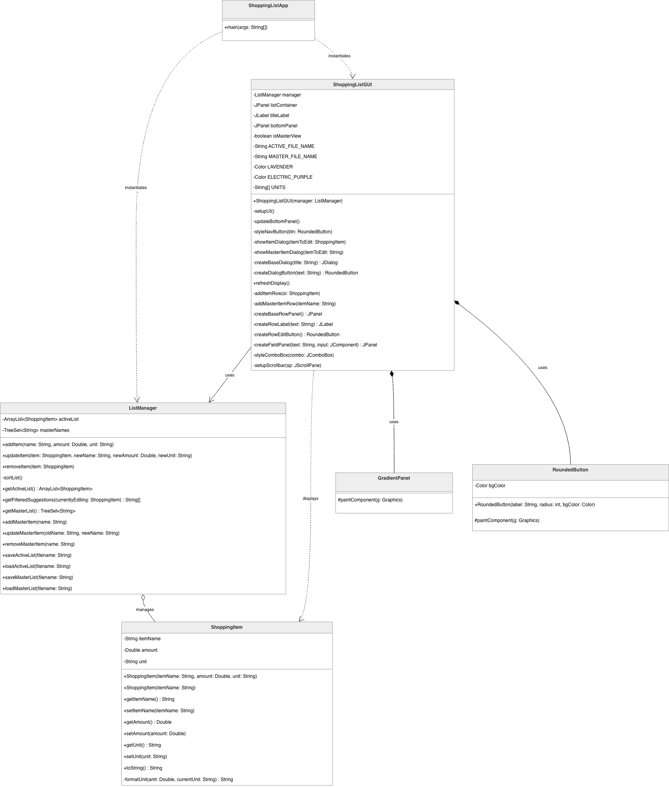
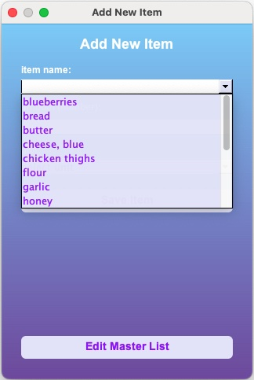
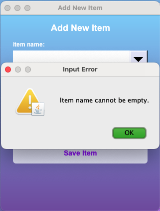

# Karen's Shopping List Manager
**Author:** Karen R. Christie  
**Developed:** April-May 2026

## Description
Karen's Shopping List Manager is a Java Swing application designed for grocery planning. It employs a decoupled **Model-View-Controller (MVC)** architecture to manage a persistent active shopping list and a persistent master history of unique items.

### Key Features:
* **Persistent Storage:** Automatically synchronizes state using `shopping_list.csv` and `master_list.csv` for the active list and historical database.
* **Default State Initialization:** If no master list is detected on the first run, the application populates the database with 25 common items to immediately demonstrate autocomplete functionality and scroll bar.
* **Contextual Autocomplete Suggestions:** Utilizes a `TreeSet` with a case-insensitive comparator to ensure master history integrity (e.g., treating "apple" and "Apple" as duplicates). When suggesting items to add, the system dynamically filters these suggestions to exclude items already present on the active shopping list.
* **Smart Unit Formatting:** The data model handles pluralization logic for common units (e.g., converting "lbs", "qts", or "pts" to singular forms when the quantity is exactly 1.0).
* **Thread-Safe Execution:** The GUI is initialized on the Event Dispatch Thread (EDT) to ensure stability within the Java Swing framework.
* **Dual Views:** Seamlessly toggles between the Active Shopping List and the Master History editor.
* **Custom UI:** Features a refined lavender and electric purple theme with custom gradient backgrounds and anti-aliased rounded buttons.
* **Input Validation:** Robust exception handling manages `NumberFormatException` and empty fields to ensure data integrity.

---

## Project Structure
The project follows a decoupled **Model-View-Controller (MVC)** architecture to ensure clear separation of concerns:

| File | Role |
| :--- | :--- |
| **`ShoppingListApp.java`** | Entry point; handles backend initialization and thread-safe GUI launch on the EDT. |
| **`ShoppingListGUI.java`** | **The View**; manages custom Swing components, event listeners, and UI state toggling. |
| **`ListManager.java`** | **The Controller**; manages data sorting, duplicate prevention logic, and CSV I/O. |
| **`ShoppingItem.java`** | **The Model**; encapsulates item data and handles complex string/unit formatting logic. |

### System Design (UML)
The following diagram outlines the class relationships and data flow within the MVC architecture:




### System Design (UML)
The following class diagram illustrates the relationships between the Model (`ShoppingItem`), the View (`ShoppingListGUI`), and the Controller (`ListManager`).


---

## How to Use It

### Prerequisites
* Java Development Kit (JDK) 11 or higher.
* A terminal or IDE.

## Installation & Running
1. **Navigate to the project root directory.**
2. **Compile the source code:**
   ```bash
   javac src/*.java
   ```
3. **Run the application:**
   ```bash
   java -cp src ShoppingListApp
   ```
   *Note: The application will automatically create `shopping_list.csv` and `master_list.csv` in the project root upon launch, if they do not already exist.*


### Installation & Running
1.  **Navigate to the source folder:**
    ```bash
    cd src
    ```
2.  **Compile the source code:**
    ```bash
    javac *.java
    ```
3.  **Run the application:**
    ```bash
    java ShoppingListApp
    ```

### Using the App
1.  **Add Items:** Click the "Add Item" button. Start typing in the dropdown; the app will suggest items from your master history.
2.  **Edit Items:** Click the "Edit" button next to any item on the active list to modify its name, quantity, or unit.
3.  **Check off Items:** Click the checkbox next to an item to remove it from your active list (it remains in the master history).
4.  **Manage Master List:** Click the "Edit Master List" button inside the Add/Edit dialog to switch views. Here, you can add, edit, or remove items from the global reference list.
5.  **Persistence:** Changes are saved automatically after every modification. The active list and master list will reload upon the next application launch.

---

## Screenshots

### Main Interface
The primary application window showing custom Swing components, gradient background, and the persistent shopping list.


---

### Smart Item Entry & Updates
The "Add" and "Edit" interfaces. The name field provides autocomplete suggestions powered by a `TreeSet` of historical items.




---

### Ability to Edit Master List
The Master List can be modified via "Add" and "Edit" interfaces that focus exclusively on editing the item name for the global database.


---

### Exception Handling & Validation
The application validates user inputs before processing:

**1. Logical Validation:** Prevents the creation of items with empty names.


**2. Data Type Validation:** Uses `try-catch` blocks to handle `NumberFormatException` when non-numeric data is entered into the amount field.
