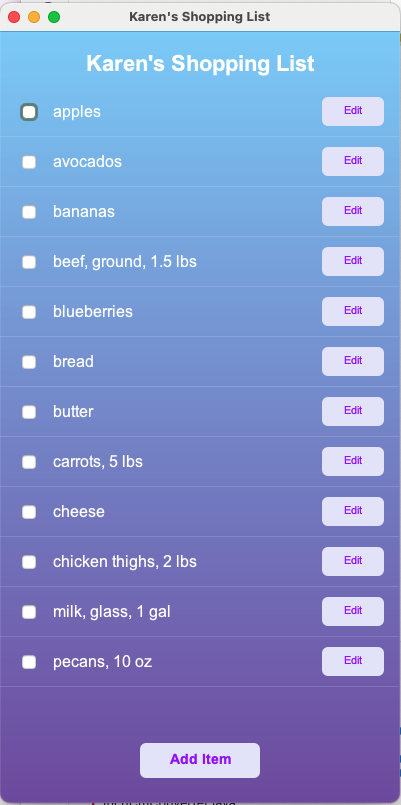
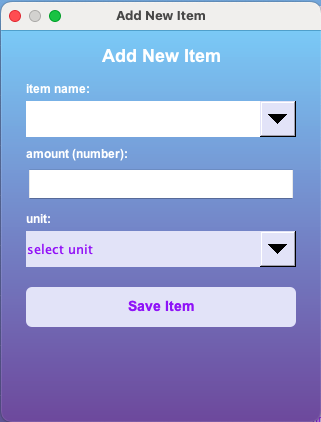
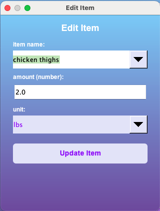

# Karen's Shopping List Manager
**Author:** [Your Name]

## Description
Karen's Shopping List Manager is a robust Java Swing application designed to simplify grocery planning. Unlike a standard text-based list, this application features a persistent storage system using CSV, a custom-designed aesthetic interface, and intelligent data management. 

### Key Features:
* **Persistent Storage:** Automatically saves and loads your list to/from a `shopping_list.csv` file.
* **Smart Suggestions:** Uses a `TreeSet` to remember every item you've ever added, providing filtered autocomplete suggestions for future entries.
* **Dynamic UI:** A custom "Electric Purple" theme featuring gradient backgrounds and anti-aliased rounded buttons.
* **Robust Validation:** Comprehensive exception handling for numeric inputs and empty fields to ensure a crash-free experience.

---

## Project Structure
The project follows a modular **Model-View-Controller (MVC)** inspired architecture:

| File | Role |
| :--- | :--- |
| **`ShoppingListApp.java`** | The entry point (Driver). Initializes the manager and launches the GUI. |
| **`ListManager.java`** | The Controller/Engine. Manages the logic for adding, updating, and file I/O. |
| **`ShoppingItem.java`** | The Model. Represents a grocery item with encapsulated fields (Name, Amount, Unit). |
| **`ShoppingListGUI.java`** | The View. Contains all Swing components, custom paint logic, and event listeners. |

---

## How to Use It

### Prerequisites
* Java Development Kit (JDK) 11 or higher.
* A terminal or IDE (like VS Code).

### Installation & Running
1.  **Navigate to the source folder:**
    ```bash
    cd src
    ```
2.  **Compile the source code:**
    ```bash
    javac *.java
    ```
3.  **Run the application:**
    ```bash
    java ShoppingListApp
    ```

### Using the App
1.  **Add Items:** Click the "Add Item" button. Start typing; the app will suggest items from your history.
2.  **Edit Items:** Click the "Edit" button next to any item to modify its quantity or name.
3.  **Check off Items:** Click the checkbox next to an item to remove it from your active list.
4.  **Persistence:** Simply close the app—your list is automatically saved to `shopping_list.csv` and will be there when you return.

---

## Screenshots

### Main Interface
The primary application window showing custom Swing components, gradient background, and the persistent shopping list.


---

### Smart Item Entry & Updates
The "Add" and "Edit" interfaces. The name field provides autocomplete suggestions powered by a `TreeSet` of historical items.



---

### Robust Exception Handling & Validation
The application is designed to be "crash-proof" by validating all user inputs before processing:

**1. Logical Validation:** Prevents the creation of empty items.


**2. Data Type Validation:** Uses `try-catch` blocks to handle `NumberFormatException` when non-numeric data is entered into the amount field.
